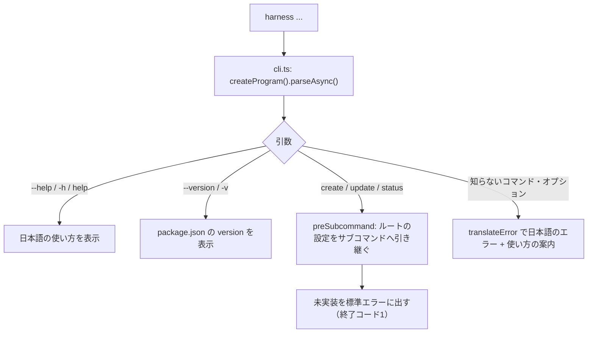

# 設計書：CLIの土台（Issue #30）

## 目的

`create`・`update`・`status` の中身を作る前に、次を整える。

- `harness --help` が日本語で3つのコマンドを表示する
- 品質チェック（`npm run check`）が手元と CI（Windows・macOS・Linux）で同じように通る
- 使うライブラリのバージョンを固定し、選定理由を記録する
- 共通仕様の番号（C-xx）がいずれかのテンプレートに割り当てられていることを CI で確かめる（F-22）

範囲外：3つのコマンドの中身（未実装と表示して終了コード1）。F-21 の表との一致の確認（Issue #38）。

## ファイルと役割

| ファイル                                                                       | 役割                                                                                                          |
| ------------------------------------------------------------------------------ | ------------------------------------------------------------------------------------------------------------- |
| `src/cli.ts`                                                                   | 入口。`createProgram()` を呼んで実行する                                                                      |
| `src/program.ts`                                                               | コマンドの定義。バージョン・ヘルプ・日本語化・サブコマンドの登録                                              |
| `src/commands/create.ts`・`update.ts`・`status.ts`                             | 各コマンド。今は「未実装」を標準エラーに出し、終了コード1にする                                               |
| `scripts/check-spec-coverage.ts`                                               | 共通仕様の対応の確認（F-22）                                                                                  |
| `scripts/pack-check.ts`                                                        | 配布物の確認（組み立て・パック・インストール・起動）                                                          |
| `test/cli.test.ts`                                                             | CLI の表示・エラー・終了コードのテスト                                                                        |
| `test/spec-coverage.test.ts`                                                   | 共通仕様の対応の確認のテスト                                                                                  |
| `test/package.test.ts`                                                         | バージョンの固定と `docs/tech-stack.md` との一致のテスト                                                      |
| `test/pack-check.test.ts`                                                      | `runWithCleanup` のテスト                                                                                     |
| `.github/workflows/ci.yml`                                                     | 3つの OS で `npm ci` → `npm run check` → `npm run pack:check`                                                 |
| `.node-version`・`.npmrc`                                                      | Node.js のバージョンの固定・ライブラリの完全一致の固定                                                        |
| `tsconfig.json`・`tsconfig.build.json`                                         | 型チェック（src・test・scripts）・ビルド（src → dist）                                                        |
| `eslint.config.mjs`・`.prettierrc.json`・`.prettierignore`・`vitest.config.ts` | Lint・整形・テストの設定。整形の対象は CLI のコードと設定ファイルだけで、`docs/`・`templates/`・`knowledge/` は外す |
| `.gitattributes`                                                               | 改行を LF にそろえる（OS による差を防ぐ）                                                                     |

## 処理の流れ

### CLI の実行

### 共通仕様の対応の確認（F-22）

1. `docs/requirements/README.md` の表から、共通仕様の番号の一覧を作る
2. `templates/` 以下の各ファイルで最初に出てくる「もとになった共通仕様：…」の行から、割り当て済みの番号を集める
3. README にあって割り当てのない番号があれば、日本語で一覧を出して終了コード1にする。README に無い番号がテンプレートにあるときはエラーにする

### 配布物の確認

1. 一時フォルダを作り、`npm run build` と `npm pack` を行う
2. 別の一時フォルダに、できた配布物をインストールする（グローバルは使わない）
3. 利用者が使うコマンド名 `harness` で `--help` を起動し、3つのコマンドが出ることを確かめる
4. 成功・失敗にかかわらず一時フォルダを片付ける

## 主な関数・型

### `createProgram`（`src/program.ts`）

- 入力：なし
- 出力：3つのコマンドを登録した commander の `Command`
- 日本語化の仕組み
  - 見出し（使い方・オプション・コマンド・引数）は `configureHelp` の `styleTitle` で置き換える
  - エラーは `configureOutput` の `outputError` から `translateError` を通す。`translateError` は、知らないコマンド・知らないオプション・オプションの値の欠落を日本語にし、それ以外の `error:` は接頭辞だけを日本語にする。その後に `showHelpAfterError` で使い方の案内を出す
  - サブコマンドは commander の既定では親の設定を引き継がないため、`preSubcommand` のフックで `copyInheritedSettings` を呼び、実行の直前にルートの設定を写す。`createProgram()` の後に利用側が足した設定（テストの出力の取得など）も届く

### `scripts/check-spec-coverage.ts`

| 関数              | 入力                                                            | 出力                                                                                               |
| ----------------- | --------------------------------------------------------------- | -------------------------------------------------------------------------------------------------- |
| `expandRange`     | 範囲の文字列（`C-12〜C-20`。全角の `～` も可）                  | 展開した番号の一覧。形が正しくない・逆順のときはエラー                                             |
| `parseSourceLine` | 「もとになった共通仕様：…」の1行（HTMLコメントまたは `#` の形） | C-xx の一覧。`・` で区切った各項目のうち、F-xx は数えず、後ろの括弧は除く。解釈できない項目はエラー |
| `collectSpecIds`  | テンプレートのフォルダ                                          | 割り当て済みの番号の集合。各ファイルの最初の該当行だけを読む                                       |
| `findUnassigned`  | README のパス・テンプレートのフォルダ                           | 割り当てのない番号（昇順）。README に無い番号がテンプレートにあるときはエラー                      |

これらは `export` してテストする。ファイルを直接実行したときだけ `main` が動く。

### `runWithCleanup`（`scripts/pack-check.ts`）

- 入力：本処理の関数・後片付けの関数
- 出力：本処理の戻り値
- 後片付けは成功・失敗にかかわらず必ず1回呼ぶ。失敗の扱いは、本処理だけ失敗なら本処理のエラー、後片付けだけ失敗なら後片付けのエラー、両方失敗なら `AggregateError`（本処理・後片付けの順）。本来の失敗を隠さないため（C-71）

## テストと確かめている受け入れ条件

| 受け入れ条件                                             | テスト                                                                                                                                                         |
| -------------------------------------------------------- | -------------------------------------------------------------------------------------------------------------------------------------------------------------- |
| AC-1：`--help` で3つのコマンドが日本語で出る             | `test/cli.test.ts`（一覧・説明・英語の見出しを含まない・未実装の表示と終了コード・知らないコマンド・`--version`・サブコマンドの `--help` とエラーの日本語化） |
| AC-2：`npm run check` が通る。CI で3つの OS で実行される | `npm run check` 自体と `.github/workflows/ci.yml`。配布物の確認は `npm run pack:check`（`test/pack-check.test.ts` は後片付けの処理を確かめる）                 |
| AC-3：ライブラリのバージョンが固定され、選定理由がある   | `test/package.test.ts`（すべて `x.y.z` の完全一致、`docs/tech-stack.md` との一致）                                                                             |
| AC-4：共通仕様の対応の確認が CI で実行される             | `test/spec-coverage.test.ts`（各関数・仮のフォルダ・今のリポジトリ全体で未割り当て0件）と `npm run check` の `spec:check`                                      |

## 関係する Issue と要件

- Issue #30：本設計書の対象。#38：F-22 の残り（F-21 の表との一致の確認）
- F-28：CLI 本体（コマンド・ライブラリ・配布の方法）
- F-22：共通仕様とテンプレートの対応の確認
- C-61：CI の実行環境。コンテナの部分は例外とした（[ADR 0001](../adr/0001-ci-without-container.md)）
- C-62：バージョンの明確化と固定（`docs/tech-stack.md`・`.node-version`）
