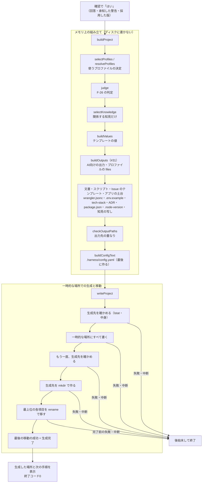

# 設計書：生成の仕組みと記録（Issue #34）

## 目的と範囲

`harness create` の最後に、プロジェクトを手元のフォルダ（`./<アプリ名>`）へ生成する。生成するファイルの一覧をメモリ上で組み立て、一時的な場所に書いてから生成先へ移す。生成の記録として `.harness/config.yaml` を作る。

- 作るもの：テンプレートの値の決定、F-26 の判定、`package.json` の組み立て、知見の写し、`docs/tech-stack.md`・承知した警告のADRの保存、`.harness/config.yaml`（管理するファイルの指紋を含む）、一時的な場所での生成と移動、`harness create` の最後の生成
- 作らないもの（Issue を分けた）
  - #56：アプリのひな形（アプリのコード・`.env.example`・`wrangler.jsonc`・`docker-compose.yml`）は、#56 で追加した（[skeleton.md](skeleton.md)）。要件定義書のひな形・PR のテンプレートなどは #63 に移った
  - #57：生成の直後の `npm install` と品質チェックによる確認
  - #55：GitHub を使わない（手元の Git だけの）プロジェクトへの対応。リモートリポジトリ・Issue の作成もこれで決める
- 生成は手元のフォルダまで。Git の初期化はしない（#55 で決める）
- `update`・`status`（#35）は扱わない。ただし `.harness/config.yaml` の `managed_files` は、#35 が差分を取るための記録である

受け入れ条件は次の4つである。

| 番号 | 内容 |
| --- | --- |
| AC-1 | 生成先に中身のあるフォルダがある場合は、エラーにして止める |
| AC-2 | 生成が途中で失敗・中断した場合、生成先にファイルが残らない |
| AC-3 | `.harness/config.yaml` に、回答・判定の結果・ハーネスのバージョン・役割とモデル・管理するファイルの指紋が記録される |
| AC-4 | 同じ `--answers` で2回生成すると、同じ結果になる（スナップショットテスト） |

実装を正とする。この設計書とコードが食い違ったときは、コードの動きを正として設計書を直す。

## ファイルと役割

| ファイル | 役割 |
| --- | --- |
| `src/generate/project.ts` | `buildProject`：生成するすべてのファイル（パス・中身・`managed`）をメモリ上で組み立てる。`isManagedPath`：管理するファイルの判定 |
| `src/generate/values.ts` | `buildValues`：ひな形の `{{名前}}` に入れる値を決める |
| `src/generate/judgment.ts` | `judge`：F-26 の判定（ASVS のレベル・有効にするルール・ペネトレーションテストの要否） |
| `src/generate/roles.ts` | `loadRoleModels`・`rolesFor`：役割ごとのモデル（選んだAIの分だけ） |
| `src/generate/knowledge.ts` | `selectKnowledge`・`knowledgeIndexRows`：写す知見の選択と、Skill「知見」の表の行 |
| `src/generate/package-json.ts` | `buildPackageJson`：生成するプロジェクトの `package.json` |
| `src/generate/config.ts` | `buildConfigText`・`fingerprint`・`localDay`・`harnessVersion`・`CONFIG_PATH`：`.harness/config.yaml` |
| `src/generate/write.ts` | `writeProject`：一時的な場所への書き込みと、生成先への移動。`GenerationInterrupted`・`FsOps` |
| `src/generate/conditions.ts` | `parseWhen`・`whenMatches`：データファイルの条件（`when`）の検証と判定 |
| `src/generate/data.ts` | `readDataYaml`・`dataPath`・`isPlainObject`：`data/` の YAML の読み込み |
| `src/generate/comments.ts` | `stripMarkerComments`（追加）：文書のどこにあっても、「もとになった共通仕様」の1行のコメントを取り除く |
| `src/generate/profile.ts` | `dev_packages` の読み込みと検証（`Profile.devPackages`）を追加。#56 で `files_when`・`wrangler`・`wrangler_when`・`package_json_when` の読み込みと、まとめ方（`selectProfileFiles`・`mergeWrangler`・`mergePackageJson`）を追加（[skeleton.md](skeleton.md)） |
| `src/generate/wrangler.ts` | `buildWranglerJsonc`：`wrangler.jsonc` の組み立て（#56。[skeleton.md](skeleton.md)） |
| `src/commands/create.ts` | 確認の後の生成（`generate`）：`buildProject` → `writeProject`、SIGINT の登録、終了コード、次の手順の表示 |
| `data/template-values.yaml` | 回答の条件で決まるテンプレートの値。リポジトリの置き場所（`repository`）で変わる手順の文も、ここで入れ替える（[local-git.md](local-git.md)）。値の中の `{{名前}}` は、ほかの値で1段だけ展開する（`expandReferences`） |
| `data/role-models.yaml` | 役割ごとのモデルの初期値（C-66 の表） |
| `data/env-items.yaml` | 環境変数の項目の一覧（`docs/secrets.md` の表。`.env.example` も同じ一覧から `buildEnvExample`（`values.ts`）が作る。項目ごとの `example` が `.env.example` の値） |
| `data/knowledge-selection.yaml` | 知見のファイルと、写す条件の対応 |
| `data/runtimes.yaml` | Node.js の検証済みの版に加えて、`compatibility_date` を持つ |
| `test/generate/*.test.ts`・`project-helpers.ts`・`__snapshots__/` | テスト。`judgment`・`knowledge`・`package-json`・`values`・`project`・`write` |
| `test/commands/create.test.ts` | 生成・AC-1・AC-2・SIGINT（実際の子プロセスを含む）・秘密情報のテスト |
| `scripts/pack-check.ts` | 配布物から生成できることの確認 |
| `scripts/smoke-generated.ts` | 生成したプロジェクトが動くことの確認（#56。[skeleton.md](skeleton.md)） |

## 処理の流れ

1. `harness create` が、質問・バージョンの調査・整合性チェック・確認を終える（[questions.md](questions.md)・[versions.md](versions.md)）
2. `buildProject` が、生成するファイルの一覧を作る。値の漏れ・ひな形の不足・出力先の重なりは `GenerateError`（日本語。ここで止まるので、何も書かれない）
3. `generate`（`create.ts`）が SIGINT の処理を登録し、`writeProject` に一覧を渡す
4. `writeProject` が一時的な場所に書き、生成先へ移す
5. 完了したら、生成した場所と次の手順を表示して終了コード0。SIGINT の処理を外す

## テンプレートの値の決め方

ひな形（`templates/`）の `{{名前}}` に入れる値は、`buildValues` が決める。**回答の条件で決まるものはデータで持ち、データに書けないものだけを計算する**（F-28：ひな形の中に条件の分岐を入れない）。値が未定義の名前がひな形にあると、#31 の差し込み（`renderTemplate`）が名前を示して `GenerateError` にする。値の漏れは生成の前に分かる。

| 値 | 決め方 |
| --- | --- |
| `check_command`・`error_handler`・`e2e_port`・`allowed_origins`・`mutation_targets` | `data/template-values.yaml` の固定の値。`allowed_origins` は開発の値で、本番は環境変数（`ALLOWED_ORIGINS`）で設定する旨がひな形側にある |
| `dev_env_notes`・`backup_notes`・`transaction_notes`・`batch_notes`・`postgres_migration_notes` | `data/template-values.yaml`。`database` の回答（PostgreSQL・D1・なし）で変わる |
| `data_access_library`・`data_access_skill`・`data_access_guide` | `data/template-values.yaml`。DB ありのときだけ Drizzle ORM と Skill「data-access-drizzle」を案内し、DB なしでは「DB を使わない」旨の文にする。`data_access_guide` は案内の行全体を値にしている（存在しない Skill を案内しないため。ひな形に条件の分岐を入れない方針を守る） |
| `app_name` | 回答 |
| `auth_method`・`database` | 回答の選択肢の表示の名前（質問の定義の `label`） |
| `asvs_level`・`pentest_requirement` | `judge` の結果（下の「F-26 の判定」）。レベル3は「3を検討（結果をADRに記録する）」、ペネトレーションテストは必須なら「初回のリリースの前に必須（理由）」、そうでなければ「任意（推奨）」 |
| `knowledge_index` | 写した知見の表の行（分野・ファイル・最初の見出し）。写すファイルと同じ一覧から作る |
| `secrets_table` | `data/env-items.yaml` の項目のうち、回答の条件に合うものの表の行。項目の値は説明だけで、実際の値は書かない |
| `compatibility_date` | `data/runtimes.yaml` |
| `claude_model_<役割>`・`codex_model_<役割>`・`codex_effort_<役割>` | `data/role-models.yaml`。選んだAIの分だけ値を持つ（Codex だけのときは Claude の値を求めない） |

`data/template-values.yaml` の書き方は、名前に文字列を書く（常に同じ）か、`- when: {...}` と `value:` の並び（上から順に見て、最初に合うものを使う）である。条件は #32 のルールの `answer` 条件と同じ（`equals`・`in`・`notEquals`）。どの条件にも合わない値は、「最後に `when` のない行を書いてください」というエラーにする。データの書き間違い（知らない項目・知らない質問の id）も、場所を示して `GenerateError` にする。

### 役割とモデル（`data/role-models.yaml`）

C-66 の表の初期値を持つ。Claude Code が主の場合の列（別名：`opus`・`sonnet`）と、Codex が主の場合の列（モデル名と推論の強さ）の2つ。統括（`orchestrator`）は会話そのもののモデルのため、Claude Code の分だけ持つ。モデルは変わるので、プロジェクトごとに `.harness/config.yaml` とエージェントの定義の両方で変えられる。

### Codex のモデル名の確かめ方

Codex のモデル名は、設定（`model = "..."`）にそのまま書ける名前でなければならない。`data/role-models.yaml` の値は、手元の Codex（`codex-cli`）のモデルの一覧（`~/.codex/models_cache.json`）で、実際に指定できる名前を確かめて書いている（確かめた日と版はファイルの冒頭のコメントにある）。モデルを入れ替えるときも同じ手順で確かめる。確かめられない場合は、推測で書かずに止めて報告する。

### `compatibility_date` の確かめ方

`wrangler.jsonc` の `compatibility_date` は、テストの道具（`@cloudflare/vitest-pool-workers`）に同梱された実行エンジン（miniflare）が対応する日付**以下**でなければならない（新しすぎると起動しない）。`data/runtimes.yaml` の値は、次の手順で確かめている。

1. `npm view @cloudflare/vitest-pool-workers@<版> dependencies` で、miniflare の版を見る
2. miniflare の版の中の日付（例：`5.YYYYMMDD.0`）が上限になる
3. その日付以下の値を `data/runtimes.yaml` に書く

テストの道具のバージョンを上げるとき（`profile.yaml` の `verified_versions` の更新）に、この日付を見直す。

## F-26 の判定（`judge`）

質問A〜G の回答（未定を含む）から、ASVS のレベル（1・2・3を検討）・有効にする共通仕様・ペネトレーションテストの要否（C-82）を決める。判定は `judge(answers)` が行い、結果は `Judgment`（`asvsLevel`・`pentestRequired`・`pentestReasons`・`undecided`・`enabledRules`）である。

| 質問 | 条件 | レベル・必須 | 有効にするルール |
| --- | --- | --- | --- |
| A 個人情報 | なし以外（扱う） | 2。特に配慮が必要なら3を検討。必須 | C-09・C-19・C-30 |
| B 管理者の機能 | ある | 2。必須 | C-14・C-20・C-30 |
| C 重要な操作 | ある | 2。決済を含めば3を検討。必須 | C-20・C-66 |
| D 共同編集 | する | 影響しない | C-14・C-64 |
| E 組織ごとのデータ分離 | 分ける | 必須（レベルは変えない） | C-14 |
| F リアルタイムの更新 | 必要 | 影響しない | C-77 |
| G 可用性 | 止まると困る（許容できる以外） | 影響しない | C-79・C-41 |

- すべてに当てはまらない場合は、レベル1・ペネトレーションテストは任意
- 条件が重なったら、いちばん高いレベルを採る。必須の理由（`pentestReasons`）は、必須にした条件の分だけ持つ
- `enabledRules` は重複がなく昇順
- **「未定」（回答がない場合も同じ）は、安全側（扱う・ある・する）として判定する**。未定の質問の id は `undecided` に入れる。未定の項目は、要件定義で決める項目として `.harness/config.yaml` に残す。未定のために必須とした理由には「未定のため、安全側として扱う」を付ける。A〜G がすべて未定なら、レベル2・必須になる
- 認証が「なし」のときの B・D は、自動で「ない」に決まるため、未定に入らない
- 「3を検討」は、ASVS レベル3を採るかを検討する意味で、検討の結果はADRに記録する。ADR への記録は利用者の作業であり、ハーネスが自動で作るものではない
- 判定の結果は `.harness/config.yaml` に記録し、要件定義書のひな形（`docs/requirements.md`）にも書き込む（#63。[documents.md](documents.md)）

## `package.json` の組み立て

`buildPackageJson` が組み立てる。キーの並びは固定で、同じ入力なら同じ中身になる。

- 先頭から：`name`（アプリ名）・`version`（`0.0.0`）・`private`（`true`）・`type`（`module`）・`engines`（`node` は選んだ Node.js の大きな版以上）。続けて、プロファイルの `package_json` と、回答に合う `package_json_when` を深くまとめたもの（`mergePackageJson`。`scripts`・`overrides` など）、`dependencies`、`devDependencies`
- プロファイルの `package_json` に、ハーネスが決める項目（`name`・`version`・`private`・`type`・`engines`・`dependencies`・`devDependencies`）を書くと `GenerateError`
- 入れるのは、実際に選ばれた依存だけ。`packages` と、回答に合う `packages_when`（`wantedPackages`）の和である。たとえば `pg` は PostgreSQL のときだけ入る
- 版は、#33 で選んだ版を**正確な版**で書く（`^`・`~` なし。C-62）。選んだ版にない依存は `GenerateError`
- `dependencies` と `devDependencies` の振り分けは、`profile.yaml` の **`dev_packages`** で決める。`dev_packages` に入っている名前は `devDependencies`、それ以外は `dependencies`。複数のプロファイルが同じ名前を持つ場合は、すべてが `dev_packages` に書いたときだけ `devDependencies` にする。名前は昇順に並べる
- `dev_packages` の検証（`loadProfile`）：名前は、`packages` と、すべての `packages_when` のパッケージの和集合に含まれなければならない。ないとエラー（書き間違いの検出）
- `.node-version`：選んだ Node.js の版（末尾に改行）。`docker-compose.yml` の `image: node:<版>` も同じ版を使う（値 `node_version`）
- ハーネス自身の `package.json` の `files` に `knowledge` を加えた。配布物に知見を入れるため

## 知見の写し

F-18 により、知見は選んだ技術に**関係するものだけ**を写す。

- `selectKnowledge` が、`knowledge/` の `README.md` 以外の `.md` を一覧にする（パスの順）。`data/knowledge-selection.yaml` に条件が書かれたファイル（`<分野>/*` も書ける）は、条件に合うときだけ選ぶ。書かれていないファイルは常に選ぶ（現在は `db/*` を `database` が `none` でないときだけ）
- 写す先は、選んだAIごとの Skill「知見」の `references/`（Claude Code：`.claude/skills/knowledge/references/`、Codex：`.agents/skills/knowledge/references/`）。分野のフォルダは保つ
- `knowledge_index`（Skill「知見」の表）は、写した一覧から作る（分野・ファイル名・各ファイルの最初の見出し）。**写すファイルと表の行は同じ一覧から作る**ので、食い違わない。最初の見出しがないファイルは `GenerateError`
- 知見の写しは、ハーネスが管理するファイルである（F-27）

## `.harness/config.yaml` の形

`buildConfigText` が作る YAML。先頭に説明のコメントがある。`buildProject` が**最後に**作り、管理するファイルの指紋の対象に自分自身は含まれない。

| キー | 中身 |
| --- | --- |
| `harness_version` | ハーネスの `package.json` の `version`（`harnessVersion`） |
| `generated_on` | 生成した日（ローカルの日付、`YYYY-MM-DD`） |
| `mode` | `create` |
| `answers` | 質問の回答（未定・自動で決まった値を含む）。質問の定義の順に並べる |
| `accepted_warnings` | 承知した警告の `id`・`message`・`reason` |
| `judgment` | `asvs_level`・`pentest_required`・`undecided`・`enabled_rules` |
| `versions` | 採用した版（`name`・`version`・`reason`・`surveyed_on`・`latest_stable`・`verified`） |
| `roles` | 役割ごとの `claude.model`・`codex.model`・`codex.effort`（選んだAIの分だけ） |
| `managed_files` | ハーネスが管理するファイルのパス → 指紋（パスの昇順） |

- 指紋（`fingerprint`）は、**改行を LF にそろえた中身の sha256**（16進・小文字）。OS が違っても同じ値になる
- 版の取得に失敗した理由（`fetchFailure`）・環境変数の値は、記録しない

## 管理するファイルとプロジェクトのものの分け方（F-27）

`isManagedPath` が、出力の各ファイルを「ハーネスが管理する」か「プロジェクトのもの」かに分ける。`buildProject` の結果の各ファイルが `managed` を持つ。管理するファイルだけを `managed_files` に指紋として記録する。#35 の `update` は、管理するファイルだけを更新し、プロジェクトのものには触れない。

| 区分 | ファイル |
| --- | --- |
| ハーネスが管理する | `AGENTS.md`・`CLAUDE.md`、Skill（`.claude/skills/`・`.agents/skills/`。知見の写しを含む）、エージェントの定義（`.claude/agents/`・`.codex/agents/`）、AI の権限の設定（`.claude/settings.json`・`.codex/rules/default.rules`）、`.github/ISSUE_TEMPLATE/`・`.github/pull_request_template.md`、`scripts/env-check.mjs`、`docs/secrets.md`、GitHub を使わない場合の `.githooks/pre-commit`・`scripts/merge-check.mjs`・`docs/issues/_template.md`・`docs/harness-feedback/README.md`（[local-git.md](local-git.md)） |
| プロジェクトのもの | プロファイルの `files`（アプリのコード・`wrangler.jsonc`・`vite.config.ts`・`vitest.config.ts`・`playwright.config.ts`・`eslint.config.mjs` など）、`package.json`、`.node-version`、`docs/tech-stack.md`、`docs/project-rules.md`、`docs/requirements.md`、`docs/adr/`、`docs/testing/`、`.github/workflows/`、`LICENSE`、`prototype/`、`public/` の仮のアイコン、`.harness/config.yaml` |

プロジェクトのものは、利用者が育てる前提のため、指紋を取らない。#56 で PR のテンプレートなどを足すときは、管理するファイルの側に加える。

## 承知した警告の ADR

承知した警告があるときだけ、`docs/adr/0001-accepted-warnings.md` を出す（C-35 の書き方）。警告がなければ出さない。項目は次のとおり。

- 見出し・状態（採用）・日付・関係（C-35・F-08）
- 背景：生成前の整合性チェックで警告が見つかり、利用者が承知して続けたこと。警告のルールの `id`・内容・理由・承知した日の表
- 選択肢：回答を変える／リスクを承知して続ける
- 決定：承知して続ける
- 理由：利用者が、内容と理由を確認して承知した
- 影響：理由に書かれたリスクをプロジェクトが引き受ける。解消するときは、このADRを消さずに新しいADRを追加する

警告の内容と理由は、整合性チェックのルールのデータ（`data/consistency-rules.yaml`）から来る。手元の道具の確認の結果（取得の失敗の理由など）は、ここに含めない。ADR はプロジェクトのもの（管理しない）。

## 生成先への移し方（`writeProject`）

生成先は `<作業中のフォルダ>/<アプリ名>`。一時的な場所は、同じフォルダの中の `.<アプリ名>.harness-tmp-<乱数>` である（同じドライブにして、名前の変更で移せるようにする）。

### 手順

1. アプリ名とすべての出力先のパスを確かめる（アプリ名にパスの区切りを含めない。出力先は相対パスで、`..`・絶対パス・`\` を含めない）。誤りがあれば何も作らずに `GenerateError`
2. **書き込みの前に**生成先を確かめる（`inspectTarget`）
3. 一時的な場所を作り、すべてのファイルを書く（フォルダは `mkdir -p`、ファイルは UTF-8）。ファイルの書き込みの間ごとに、中断の要求を確かめる
4. **移動の直前に**、もう一度生成先を確かめる
5. 生成先が空のフォルダなら、`rmdir`（空でなければ失敗する操作）だけで消す。再帰の削除は使わない
6. 生成先を `mkdir`（再帰なし）で作る。すでにあれば `EEXIST` で失敗する
7. 一時的な場所の最上位の各項目を、生成先の中へ `rename` で移す（項目を名前の順に）
8. 最後の項目の移動が成功したら完了。空になった一時的な場所を `rmdir` で消す

### 生成先の確かめ方（AC-1・リンクと競合）

- `lstat`（リンクをたどらない）で確かめる。ない（`ENOENT`）なら「なし」、空のフォルダなら「空」
- **中身のあるフォルダ・同じ名前のファイル・シンボリックリンク・ジャンクション（Windows）は、`GenerateError`**（生成先は消さず、触らない）。リンクの先には生成しない
- `ENOENT` 以外の確認の失敗（`EACCES` など）は、原因をそのまま伝えて止める。「競合」などに言い換えない
- 質問の段階の整合性チェック（ルール10）でも先に止まるが、書く直前と移動の直前にもう一度確かめる。確かめてから書いて移すまでの間に、別のものが置かれることがあるため
- 移動の直前の確かめの後で生成先が作られた場合は、`mkdir` が `EEXIST` で失敗する。このときは**生成先には触らず**、一時的な場所を消して「書いている間に別のものが置かれました」とエラーにする
- 空のフォルダを `rmdir` で消した後、`mkdir` の前に別のものが置かれた場合も、同じく生成先には触らない

`rename` は、生成先が**ない状態**でだけ行う（空のフォルダに対する `rename` は、OS によって上書きされたり失敗したりするため、`mkdir` で自分が作った生成先の中へ項目を移す方式にした）。

### 移動の再試行

Windows では、ウイルス対策ソフトなどの影響で `rename` が一時的に失敗する（`EPERM`・`EBUSY`）ことがある。この2つのコードだけ、待ちを増やしながら最大8回まで試す（50ミリ秒 × 試行の回数）。それ以外のエラー（`EACCES` など）は、1回で諦める。再試行のあいだに、生成先を削除しない。上限を超えたら、後始末してエラーにする。

### 完了の境界

**最後の項目の `rename` が成功した時点を「生成完了」とする**。

- それより前の失敗・中断：後始末（下）をして終わる。生成先にファイルは残らない
- 完了の後：生成先は消さない。空になった一時的な場所を消せなければ「生成は完了しましたが、手で削除してください」と場所を示すエラー（`GenerateError`）にする
- 完了の後に届いた中断の要求は、`interrupted: true` で呼び出し側に伝える。生成先は残す

### 中断（SIGINT）

`create.ts` の `generate` が、`buildProject` の後・`writeProject` の呼び出しの間だけ SIGINT の処理を登録する（終わったら外す）。受けたら `AbortController` で「中断の要求」を立てる。`writeProject` は、各ステップ（確かめ・書き込みの各ファイル・`rmdir`・`mkdir`・各項目の移動の各試行）の前に要求を確かめ、立っていれば `GenerationInterrupted` を投げる。進行中の書き込みが終わるのを待ってから、後始末する。

| 状況 | 動き |
| --- | --- |
| 完了前に中断 | 一時的な場所などを消して、「中断しました。ファイルは作成していません。」・終了コード130 |
| 完了後に中断 | 生成先を残し、「中断の要求を受けましたが、生成は完了しています」・終了コード130 |

### 失敗と中断の後始末（`rollback`）

完了前の失敗・中断では、次の順に消す：**移した項目 → 自分が作った生成先（空のときだけ、`rmdir`）→ 一時的な場所**。元から空のフォルダがあった場合、移動の手順で一度消しているため、後始末の後は「ない」か「空のフォルダ」のどちらかになる（中身は残らない。中身のあるフォルダは、そもそも触らない）。消せなかった場所は、場所を示して `GenerateError` にする（もみ消さない。「手で削除してください」と案内する）。元のエラーは `cause` に残す。

### テストのための窓口

ファイル操作は `FsOps`（`mkdir`・`writeFile`・`lstat`・`readdir`・`rmdir`・`rename`・`rm`・`sleep`）を通す。テストでは一部だけ差し替えて、途中の失敗・競合・再試行・中断を再現する。`runCreate` の `generateFs` から渡せる。`harness create` の実行時は本物のファイル操作を使う。

## 秘密情報を生成物に入れないこと

秘密情報を、生成するファイルに入れない。仕組みは次のとおり。

- `buildProject` は、`process.env` を読まない。入力は、回答・承知した警告・採用した版・日付だけである
- 版の取得に失敗した理由（`fetchFailure`）は、生成するファイル（`docs/tech-stack.md`・`config.yaml`）に入れない。接続の失敗のメッセージには、環境やプロキシの情報が含まれうるため
- `docs/secrets.md` の表（`data/env-items.yaml`）は、環境変数の**名前と、各環境で何を入れるかの説明**だけを書く。実際の値は書かない。値は `.env`（`.gitignore` の対象）や、各環境のシークレットに置く
- テスト：`process.env` の項目と、取得の失敗の理由に目印を入れて生成し、どのファイルのパスにも中身にも目印が含まれないことを確かめる（`buildProject` と `create` の両方）

## テストと受け入れ条件の対応

| 受け入れ条件・見直し | テスト |
| --- | --- |
| AC-1 | `test/generate/write.test.ts`：中身のあるフォルダ・同じ名前のファイルでエラー（何も書かず、既存の中身が変わらない）、空のフォルダなら生成できる、出力先の外へ出るパスの拒否。`test/commands/create.test.ts`：create から見ても同じ |
| AC-2 | `write.test.ts`：3つ目の書き込みの失敗・最後の書き込みの失敗で、生成先も一時的な場所も残らない。一時的な場所を消せないときは場所を示すエラー。`create.test.ts`：生成の途中の失敗 |
| AC-3 | `test/generate/project.test.ts`：`config.yaml` を YAML として読み、各キーを確かめる。`managed_files` の指紋が実際の sha256 と一致し、プロジェクトのものを含まない。`roles` は選んだAIの分だけ。秘密情報が入らないこと |
| AC-4 | `project.test.ts`：同じ入力で2回組み立てて同じ結果。違うのは `generated_on` だけ。スナップショット（ファイルの一覧と指紋。`__snapshots__/`）。`create.test.ts`：同じ `--answers` で2回生成して同じ結果 |
| R1：移動の安全 | `write.test.ts`：確かめた後に別のファイルが置かれる・生成先がリンク・書いている間にリンクに置き換えられる・`mkdir` の `EEXIST`・`rmdir` だけで消す・再試行（`EPERM`・`EBUSY`）と上限・項目の移動の途中の失敗 |
| R2：中断 | `write.test.ts`：書き込みの途中・移動の再試行の途中・`rmdir` の最中・項目の移動の途中・最後の項目の移動の直後・空になった一時的な場所の `rmdir` の最中に要求を立てる。`create.test.ts`：`process.emit("SIGINT")` による中断。実際の CLI は、子のプロセスで起動して SIGINT を送る（Windows では SIGINT の送信が難しいため飛ばし、プロセス内のテストで代える） |
| R3：`dev_packages` | `test/generate/profile.test.ts`（検証・知らない名前のエラー）、`package-json.test.ts`（振り分け・`pg` は PostgreSQL のときだけ・`^` がない・`engines`） |
| R4：知見は関係するものだけ | `knowledge.test.ts`・`project.test.ts`：DB なしで `db/` の知見が写らず、索引の行もない。索引の行数は写したファイル数と同じ |
| R5：管理するファイルの分類 | `project.test.ts`：`managed_files` のパスの集合が、管理するものの一覧と完全に一致する（足りない・余分の両方を検出） |
| R6：DB なしのときの案内 | `project.test.ts`：Claude だけ・Codex だけ・両方 × DB なし・D1・PostgreSQL の9通りで、実際のひな形から生成し、未定義の値がなく、Skill の案内の参照先が出力に存在する |
| R7：判定 | `judgment.test.ts`：各条件を単独で満たす表、条件の重なり、`enabled_rules` の昇順、未定は安全側 |
| R8：承知した警告の ADR | `project.test.ts`：警告があるときだけ出る、C-35 の項目・警告の id が記録される |
| 値 | `values.test.ts`：DB なし・D1・PostgreSQL で値が変わる、未定義の値はエラー、Codex だけで Claude の値を求めない |
| 配布物 | `scripts/pack-check.ts`：配布物をインストールし、一時的なフォルダに生成して `.harness/config.yaml` と `AGENTS.md` ができることを確かめる（`data/`・`knowledge/` が配布物に入っていることの確認になる）。`test/package.test.ts`：`files` に `knowledge` がある |

テストの値・名前はすべて架空のもの。生成先は一時的なフォルダで、テストの後に消す。

## 関係する Issue と要件

| 区分 | 内容 |
| --- | --- |
| Issue | #34（このIssue）、#31（差し込みとプロファイル）、#32（質問と整合性チェック）、#33（バージョンの調査）、#35（update。`managed_files` を使う）、#55・#56・#57（範囲から分けたもの） |
| 機能要件 | F-18（知見は関係するものだけ）、F-24（`dev_packages`）、F-26（判定）、F-27（管理するファイルの分け方）、F-28（ひな形に条件の分岐を入れない）、F-08（整合性チェック・警告の承知） |
| 共通仕様 | C-35（ADR の書き方）、C-62（版を固定）、C-66（役割とモデル）、C-82（ペネトレーションテスト） |

## 引き継ぎ

- #56（アプリのひな形・`.env.example`）は済み（[skeleton.md](skeleton.md)）。#63：要件定義書のひな形（判定の結果を記録する）・PR のテンプレート（管理するファイルに加える）
- #57：生成の直後の `npm install` と品質チェック
- #55：Git の初期化・リモートリポジトリ・GitHub を使わない場合
- #35：`.harness/config.yaml` の `managed_files`・`harness_version` を使って、更新の差分を取る
