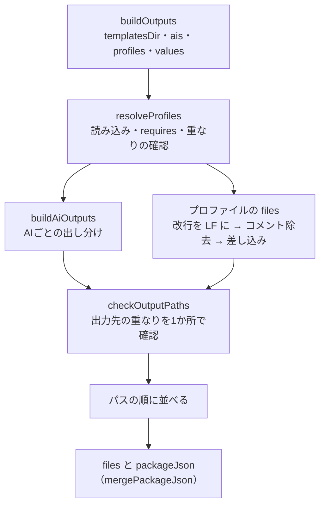

# 設計書：ひな形の差し込みとプロファイルの読み込み（Issue #31）

## 目的と範囲

`templates/` のひな形に回答の値を差し込み、選んだAIとプロファイルに応じて「出力するファイルの一覧（出力先の相対パスと中身）」をメモリ上で作る。

- 作るもの：差し込み、プロファイルの読み込みと検証、AIごとの出し分け、出力先の重なりの検証
- 作らないもの：ディスクへの書き込み・一時フォルダ・指紋（#34）、質問と回答の検証（#32）、バージョンの調査と `package.json` の依存の版（#33）、update（#35）
- `harness create` の動作は変えない（未実装と表示して終了コード1）
- 権限の設定（F-25）は、中身を変えずに出力先へ出すところまで。`codex execpolicy check` による判定の確認は、生成を行う #34 で行う
- `templates/docs`・`scripts`・`.github` など、F-21 の表にない共通のひな形の出し分けは #34 で扱う

## ファイルと役割

| ファイル | 役割 |
| --- | --- |
| `src/generate/errors.ts` | `GenerateError`。日本語のメッセージで、どのファイル・どの名前かを示す |
| `src/generate/template.ts` | `renderTemplate`：`{{名前}}` と `{{include:...}}` の差し込み。`normalizeNewlines`（改行を LF にそろえる） |
| `src/generate/comments.ts` | ハーネス用の説明のコメントの除去（`stripHarnessComments`・`stripPreambleComments`） |
| `src/generate/profile.ts` | `loadProfile`・`resolveProfiles`・`mergePackageJson`：`profile.yaml` の読み込みと検証 |
| `src/generate/frontmatter.ts` | `splitAgentTemplate`：エージェントのひな形を、冒頭（YAML）と本文に分ける |
| `src/generate/toml.ts` | `tomlString`・`toToml`：Codex のエージェント用の TOML を書く |
| `src/generate/paths.ts` | `checkOutputPaths`：出力先の重なりの検証 |
| `src/generate/adapter.ts` | `buildAiOutputs`：AGENTS.md・CLAUDE.md・Skill・エージェントの定義・権限の設定を、選んだAIごとに出し分ける |
| `src/generate/plan.ts` | `buildOutputs`：上をまとめ、出力するファイルの一覧と `packageJson` を返す（#34 が書き込みに使う） |
| `src/generate/templates-dir.ts` | `findTemplatesDir`：`templates/` の場所を解決する |
| `test/generate/*.test.ts`・`helpers.ts` | テスト。`template`・`profile`・`adapter`・`plan`・`templates-dir` |
| `test/generate/fixtures/templates/` | テスト用の小さなひな形とプロファイル（架空の値だけ） |

## 処理の流れ

1. `resolveProfiles` が選ばれたプロファイルを読み、`requires` の不足・出力先と `skill_name` の重なりを調べる
2. `buildAiOutputs` が、共通のひな形と Skill・エージェントを、選んだAIの置き場所と形式で出す
3. プロファイルの `files` の元のファイルを読み、コメントを除去し、差し込んで出力先に出す
4. AI向けの出力とプロファイルの `files` をまとめて、`checkOutputPaths` で重なりを調べる
5. パスの順に並べて返す。`packageJson` は `mergePackageJson` の結果

## 主な関数と入力・出力

| 関数 | 入力 | 出力 |
| --- | --- | --- |
| `renderTemplate` | ひな形の文字列・値（名前→文字列）・`templatesDir` とファイル名 | 差し込み後の文字列。未定義の名前・引用の誤りは `GenerateError` |
| `loadProfile` | `templatesDir`・`"<分類>/<id>"` | 検証済みの `Profile` |
| `resolveProfiles` | `templatesDir`・選んだキーの一覧 | 選んだ順の `Profile` の一覧。不足・重なりは `GenerateError` |
| `mergePackageJson` | `Profile` の一覧 | `package_json` を深くまとめたもの。渡した値は書き換えない |
| `splitAgentTemplate` | エージェントのひな形・ファイル名 | 冒頭（YAML を読んだもの）と本文 |
| `buildAiOutputs` | `templatesDir`・`ais`・`profiles`（`Profile`）・`values` | `{ path, content }` の一覧 |
| `buildOutputs` | `templatesDir`・`ais`・`profiles`（キーの一覧）・`values` | `{ files: { path, content }[], packageJson }` |
| `findTemplatesDir` | なし | `templates/` の絶対パス。なければ `GenerateError` |

出力のパスは `/` 区切りの相対パス。並びはパスの順で、同じ入力なら同じ結果になる（#34 のスナップショットのため）。ディスクには書かない。

## AIごとの出し分け（F-21）

| ひな形 | Claude Code | Codex |
| --- | --- | --- |
| `templates/AGENTS.md` | `AGENTS.md` | `AGENTS.md` |
| `templates/CLAUDE.md` | `CLAUDE.md` | 出さない |
| `templates/skills/<名前>/SKILL.md`・プロファイルの `SKILL.md` | `.claude/skills/<名前>/SKILL.md` | `.agents/skills/<名前>/SKILL.md` |
| `templates/ai-settings/claude-settings.json` | `.claude/settings.json` | 出さない |
| `templates/ai-settings/codex-default.rules` | 出さない | `.codex/rules/default.rules` |
| `templates/agents/<名前>.md` | `.claude/agents/<名前>.md` | `.codex/agents/<codex.name>.toml` |

両方を選ぶと両方を出す（`AGENTS.md` は1つ）。プロファイルの Skill の出力先の名前は `skill_name`。AIの選択肢は `claude`・`codex` だけで、それ以外・0個はエラー。`ais` の並び・重複で結果は変わらない。

## 決めた仕様

### 差し込み

- 名前の形：`{{` + `[a-z][a-z0-9_]*` + `}}`。空白を許さない。JSX の `style={{ color: "red" }}` や `{{ x }}` は対象にしない（エラーにもしない）
- 引用の形：`{{include:<分類>/_shared}}`。`templates/profiles/<分類>/_shared/SKILL.md` を読む。形が違う（`..` を含む等）・引用先がない・引用の中の引用（循環を避けるため）はエラー
- 順序：(1) 引用を展開する、(2) 展開後にある名前を集め、値がないものをすべてエラーにする（置き換える前に判定する）、(3) 1回だけ走査して置き換える
- 値の中の `{{x}}` は再展開せず、文字列のまま残す。未定義の判定は、ひな形にもとからある名前だけが対象
- 値は文字列だけ。文字列でない値はエラー。エラーには、ファイル名と足りない名前（重複なし、すべて）を示す
- 改行は LF にそろえる（ひな形・引用先・値のすべて）。対象は UTF-8 の文字のファイルだけ

### ハーネス用の説明のコメントの除去

出力に、ハーネス用の説明（もとになった共通仕様・番号の一覧）を残さない。

- Markdown：Skill の冒頭（`---`）の直後、または文書の最初の見出しより前にある `<!-- ... -->` の行を取り除く。文書の途中のコメントは残す
- コードなどのファイル：先頭の「もとになった共通仕様」を書いたコメントの行だけを取り除く。通常のコードのコメントは残す
- `codex-default.rules` は、先頭の `# もとになった共通仕様` の行だけを取り除く（`.rules` の先頭の `#` 行。ほかの行はそのまま）。`claude-settings.json` はそのまま出す
- 引用先（`_shared/SKILL.md`）は、先頭の HTML コメントの行を取り除いてから差し込む
- 取り除くのは、改行を LF にそろえた後。そろえる前だと、CRLF のファイルでは行末の `\r` のために判定に失敗し、コメントが残る（コードレビューの2回目で見つかり、順番を直した）

### 必須のひな形

`AGENTS.md`・`skills/`・`agents/`・各プロファイルの `SKILL.md` は必須で、なければ足りないファイル名を示してエラーにする（C-71）。`CLAUDE.md` と Claude の設定は Claude を選ぶときだけ、Codex のルールは Codex を選ぶときだけ必須。

### エージェントのひな形

- 冒頭（YAML）と本文に分ける。冒頭は差し込みの前に `yaml` で読む。引用符のない `{{...}}` は YAML では文字列にならないため、`templates/agents/*.md` の冒頭の値はすべて `"{{claude_model_planner}}"` のように引用符で囲む
- 冒頭の項目は `name`・`description`・`claude`・`codex` だけ。知らない項目はエラー
- **選んだAIの値だけを求める**：`claude:` は Claude を選んだときだけ、`codex:` は Codex を選んだときだけ読んで差し込む。選んでいないAIの値（Codex だけのときの `claude_model_*` 等）は渡さなくてよい
- Claude：`name`・`description` と `claude:` の中身（`tools`・`model`）だけの冒頭に作り直し、本文はそのまま。`codex:` は残さない
- Codex：`name`・`description`（共通の項目から）・`model`・`model_reasoning_effort`・`sandbox_mode`（`codex:` から）と、`developer_instructions`（本文）。`codex:` の中に `name`（英数字・`-`・`_`）が必須で、出力のファイル名になる。`description`・`developer_instructions` は `codex:` の中に書けない

### Codex の TOML の書き方

- 依存を増やさず自前で書く（`toml.ts`）。キーは英数字・`_`・`-` だけ
- 文字列は本文も含めてすべて基本文字列（`"..."`）にする。`\`・`"`・改行（`\n`）・タブ（`\t`）・そのほかの制御文字と DEL（`\uXXXX`）をエスケープする。複数行の書き方（`"""`）は使わない（制御文字の扱いが1つで済み、本文に `"""` があっても壊れない）
- 対になっていないサロゲートはエラー
- 出力が TOML として正しいことは、テストの中だけで `smol-toml`（開発用の依存）で読み戻して確かめる

### プロファイルの読み込み

- 許す項目：今ある8つの `profile.yaml` の項目。知らない項目はエラー（書き間違いを見つけるため）
- 必須：`id`・`category`・`name`・`skill_name`。`id`・`category` はフォルダの名前と一致すること
- `files`：元のファイルがなければエラー。元・出力先とも絶対パス・`..` を含む場合はエラー。同じプロファイル内の出力先の重なりもエラー
- `includes`：`<分類>/_shared` がなければエラー
- `requires`：選ばれていないものがあれば、足りないものをすべて示してエラー。**自動では足さない**（何を入れるかは利用者が決める、C-32）
- `optional_packages`：読み込むだけで、`package_json` の依存には加えない（必要になったときに承認を得て追加する、C-32）
- 同じプロファイルを2回選ぶとエラー。2つのプロファイルの `files` の出力先、または `skill_name` が重なってもエラー
- `mergePackageJson`：深くまとめる。同じ項目に違う値（型の違いを含む）があればエラー。`"$zod"` のような値はそのまま残す

### 出力先の重なりの検証

`checkOutputPaths` が、AI向けの出力とプロファイルの `files` をまとめて1か所で調べる。重なり：同じパス、大文字・小文字だけが違うパス、あるファイルが別の出力の親フォルダになる場合。重なった2つのパスを示してエラーにする。似た名前（`.claude-extra/x.ts` と `.claude`）は重なりにしない。

### templates の場所

`new URL("../../templates/", import.meta.url)` で探す。`src/generate/`・`dist/generate/` のどちらからも直下の `templates/` に届き、作業中のフォルダには依存しない。テストでは fixtures の場所を渡す。

### 既存のひな形の修正

- `templates/profiles/backend-framework/hono/files/error-handler.ts` の `../logger/logger` を `./logger/logger` にした（出力先が `backend/src/lib/error-handler.ts` と `backend/src/lib/logger/logger.ts` のため）
- `templates/agents/*.md`（8ファイル）の冒頭の値を引用符で囲んだ

## テストと確かめている受け入れ条件

| 受け入れ条件 | テスト |
| --- | --- |
| AC-1：`{{名前}}` が値に置き換わり、未定義が残るとエラー | `test/generate/template.test.ts`（置き換え・未定義の名前の一覧・再展開しない・JSX を触らない・文字列でない値・LF）、`plan.test.ts`（プロファイルの `files` の未定義・CRLF の値） |
| AC-2：`{{include:...}}` で共通の部分が引用される | `template.test.ts`（展開・先頭のコメント除去・引用先なし・形の誤り・引用の中の引用）、`plan.test.ts`（`files` のコメント除去・元が CRLF・CR の場合） |
| AC-3：選んだAIの置き場所と形式で出力される | `adapter.test.ts`（AIごとのパス・選んだAIの値だけ・設定とルールの中身・Codex の TOML を読み戻して一致・エスケープ・実際の `templates/` で全エージェント・全 Skill・コメントが残らない）、`plan.test.ts`（並び・同じ結果）、`templates-dir.test.ts`（src と dist の両方・作業フォルダに依存しない） |
| AC-4：`requires` の不足・`files` の元がなければエラー | `profile.test.ts`（実際の8つが読める・不足を全部示す・元がない・知らない項目・id の不一致・重なり・2回選ぶ・`package_json` の衝突）、`plan.test.ts`（Hono とロガーの結合で相対 import の先がすべて出力に含まれる・出力先の重なり・`optional_packages` を依存に加えない） |

## 関係する Issue と要件

- Issue #31：本設計書の対象。#32（質問と回答の検証）・#33（バージョン）・#34（書き込み・指紋）・#35（update）が後続
- F-21：AIごとの出し分けの表
- F-25：権限の設定（中身を変えずに出力先へ出す）
- C-32：何を入れるかは利用者が決める（`requires`・`optional_packages`）
- C-71：必須のひな形がなければエラーにする
- C-38：個々の名前の一覧を実行時に二重管理しない（欠落はテストで確かめる）
