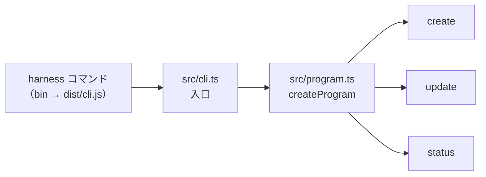

# CLI全体の構成

ハーネスを生成・更新するCLI（`harness`）の構成の地図です。個々の設計は、このフォルダの各設計書にあります。

## コマンド

| コマンド | 役割                                       | 状態                          | 担当の Issue |
| -------- | ------------------------------------------ | ----------------------------- | ------------ |
| `create` | 質問に答えて、プロジェクトを生成する | 質問・バージョンの調査・整合性チェック・生成（手元のフォルダまで） | #31〜#34     |
| `update` | 生成済みのプロジェクトに、新しいハーネスを反映する | 未実装（同上）                | #35          |
| `status` | 今のハーネスのバージョン・最新のバージョン・主な変更点を表示する | 未実装（同上）                | #35          |

`create` は、質問（`--answers <file>` で回答のファイルも渡せる）、バージョンの調査と選択、整合性チェックを行い、回答の一覧・採用するバージョン・チェックの結果を見せて確認する（`--yes` で最後の確認を省ける）。確認の後は、`./<アプリ名>` に生成する（一時的な場所に書いてから移す。生成の記録として `.harness/config.yaml` を作る）。Git の初期化・リモートリポジトリの作成（#55）、生成の直後の `npm install` と品質チェック（#57）、アプリのひな形（#56）は、まだない。詳細は [questions.md](questions.md)・[versions.md](versions.md)・[generation.md](generation.md)。

## ディレクトリと役割

| 場所         | 役割                                                                                                 |
| ------------ | ---------------------------------------------------------------------------------------------------- |
| `src/`       | CLI のコード。入口（`cli.ts`）、コマンドの定義（`program.ts`）、各コマンド（`commands/`）            |
| `src/generate/` | ひな形の差し込み・プロファイルの読み込み・AIごとの出し分け（[generator.md](generator.md)）、テンプレートの値の決定・判定・`package.json`・知見の写し・`.harness/config.yaml`・一時的な場所での生成と移動（[generation.md](generation.md)） |
| `src/questions/` | 質問の定義・質問の進め方・`--answers` の読み込みと検証・入力の窓口（[questions.md](questions.md)） |
| `src/checks/` | 整合性チェック（ルールの読み込みと判定）・事実の収集・手元の道具の確かめ（[questions.md](questions.md)） |
| `src/versions/` | バージョンの調査と選定：使うプロファイルの決定・調べる対象・npm と Node.js の登録情報の取得・最新の安定版の選び方・利用者の選択・tech-stack.md の中身（[versions.md](versions.md)） |
| `data/`      | データファイル（整合性チェックのルール `consistency-rules.yaml`、使うプロファイルの対応表 `profile-selection.yaml`、Node.js の検証済みの版と `compatibility_date` を持つ `runtimes.yaml`、テンプレートの値 `template-values.yaml`、役割ごとのモデル `role-models.yaml`、環境変数の項目 `env-items.yaml`、写す知見の条件 `knowledge-selection.yaml`。配布物に含める） |
| `scripts/`   | 開発とCIで使う確認のスクリプト（共通仕様の対応の確認、配布物の確認）                                 |
| `test/`      | テスト（vitest）                                                                                     |
| `templates/` | 生成するハーネスのひな形（配布物に含める）                                                           |
| `docs/`      | 要件定義（`requirements/`）、設計（`design/`）、決定の記録（`adr/`）、技術スタック（`tech-stack.md`） |
| `knowledge/` | 蓄積した知見（生成するプロジェクトの Skill「知見」に、関係するものだけ写す。配布物に含める）         |
| `dist/`      | ビルドの出力（Git管理の対象外）                                                                      |

## 処理の流れ

1. `src/cli.ts` が `createProgram()` を呼び、コマンドの引数を解析して実行する
2. `src/program.ts` が、バージョン・ヘルプ・日本語化・サブコマンドの登録を行う
3. `src/commands/` の各コマンドが処理する（`create` は質問・バージョンの調査・整合性チェック・生成まで。`update`・`status` は未実装の表示のみ）

## 開発のコマンド

| コマンド             | 内容                                                                                                                   |
| -------------------- | ---------------------------------------------------------------------------------------------------------------------- |
| `npm run check`      | Lint・型チェック・整形の確認・共通仕様の対応の確認・テスト・依存の脆弱性の確認を順に実行する。CI も同じコマンドを使う |
| `npm run pack:check` | 組み立て・パック・一時フォルダへのインストール・`harness --help` の起動までを確かめる。CI でも実行する                 |
| `npm run build`      | `src/` を `dist/` に組み立てる                                                                                         |

## 設計書の一覧

- [CLIの土台（Issue #30）](cli-foundation.md)
- [ひな形の差し込みとプロファイルの読み込み（Issue #31）](generator.md)
- [質問と整合性チェック（Issue #32）](questions.md)
- [バージョンの調査と選定（Issue #33）](versions.md)
- [生成の仕組みと記録（Issue #34）](generation.md)
- 決定の記録：[0001 CIでコンテナを使わない](../adr/0001-ci-without-container.md)
