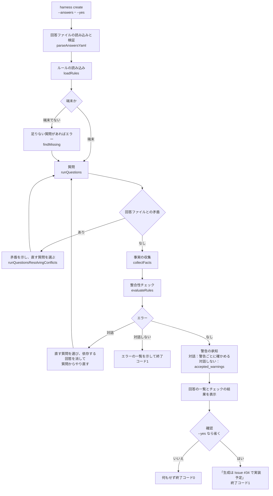

# 設計書：質問と整合性チェック（Issue #32）

## 目的と範囲

`harness create` で、質問を定義の順に聞き、回答どうしの組み合わせを整合性チェックで確かめ、回答の一覧とチェックの結果を見せて確認するところまでを行う。

- 作るもの：質問の定義（データ）、質問の進め方（条件・自動決定）、`--answers` の読み込みと検証、整合性チェック（ルールはデータファイル）、`harness create` からの呼び出し
- 作らないもの
  - 生成・ADR の書き込み・`.harness/config.yaml`：#34。警告を承知で続行した内容は、結果のオブジェクト（`acceptedWarnings`）に入れて返し、#34 が ADR に書く
  - F-26 の ASVS のレベルの判定と、「未定」を安全側として扱うこと：#34。#32 は「未定」を含む回答を返すまで
  - バージョンの調査と比較：#33。ルール7は、#33 が渡す「検証済みより新しい」の事実を受けて判定する形だけを作る（#32 では常に偽）
- 確認の後は「生成は Issue #34 で実装予定です」と表示し、終了コード1で終わる（ファイルは作らない）

## ファイルと役割

| ファイル | 役割 |
| --- | --- |
| `src/questions/definitions.ts` | `questionDefinitions`：質問の定義（データ）。`matchesCondition`（条件の判定）・`validateValue`（値の確かめ） |
| `src/questions/app-name.ts` | `validateAppName`：アプリ名の確かめ。対話の入力と、ルール9の事実の両方がこれだけを使う |
| `src/questions/answers.ts` | `Answers`（回答の型）・`parseAnswersYaml`（`--answers` の読み込みと検証）・`AnswersError` |
| `src/questions/flow.ts` | `runQuestions`（定義の順に質問する）・`runQuestionsResolvingConflicts`（YAML と対話の矛盾の扱い）・`findMissing`（足りない質問の一覧） |
| `src/questions/prompter.ts` | `Prompter`：入力（text・select・multiselect・confirm）と表示（note）の窓口。`createClackPrompter` が本番、テストは偽物。Ctrl+C は `CancelledError` |
| `src/checks/rules.ts` | `loadRules`・`parseRules`（ルールのデータの読み込みと検証）・`evaluateRules`（判定）・`Facts`・`FACT_NAMES`・`RulesError` |
| `src/checks/facts.ts` | `collectFacts`：回答以外の事実（ルール7・8・9・10）を集める |
| `src/checks/tools.ts` | `checkTools`：手元の道具（node・git・docker）の有無とバージョンを調べる |
| `src/checks/target-dir.ts` | `isNonEmptyDir`：生成先に中身があるかの判定。生成（#34）と同じ判定を使うためここに置く |
| `src/checks/review.ts` | `reviewAnswers`：チェック → 警告の承知 → エラーの聞き直し。`dependentsOf`（依存する質問を定義から求める）・`AcceptedWarning` |
| `src/commands/create.ts` | `runCreate`・`createCommand`：質問 → チェック → 表示 → 確認。終了コードを決める |
| `data/consistency-rules.yaml` | F-08 の初回のルール10件（配布物に含める。場所は `templates/` と同じく、ファイルの位置から相対で探す） |
| `test/questions/*`・`test/checks/*`・`test/commands/create.test.ts` | テスト |

## 処理の流れ

実際の呼び出しは `src/commands/create.ts` の `run` が行う。ルールの読み込みに失敗したとき・`accepted_warnings` に知らない id があるときは、質問の前に終了コード1で終わる。

## 質問の定義

`questionDefinitions` の1件が1つの質問。

- 持つ項目：`id`（英小文字とアンダースコア。`--answers` のキーにもなる）・`title`（日本語の見出し）・`kind`（`text`・`select`・`multiselect`）・`options`（値は英字、表示は日本語）・`when`・`forced`・`initialValue`・`interactive`・`defaultValue`・`placeholder`・`validate`
- 順番は functional.md の「対話の質問順（案）」のとおり（アプリ名、使用AI、…、バージョン方針）
- 質問の追加は、定義の配列に足すだけで済む（C-38）。ただし `Answers` の型にも書き足す

### 自動で決まる質問

選択肢が1つの `select` は、聞かずに決めて表示する（「◯◯：△△（自動で決定）」）。

- `project_type`・`layers`・`frontend`・`backend`・`infra`・`data_access`
- `data_access` は `database` が `none` 以外のときだけ（`when`）

### 条件で決まる質問

| 質問 | 聞く条件（`when`） |
| --- | --- |
| `postgres_provider` | `database` が `postgresql` |
| `data_access` | `database` が `none` 以外 |
| `idp` | `auth` が `oidc` か `both` |
| `critical_ops_kinds` | `critical_ops` が `yes`（聞かない質問のため、`--answers` に書いたときだけ） |
| `file_kinds` | `file_upload` が `yes` |

条件に合わない質問は飛ばし、回答に入れない。条件の対象の回答がまだないときは、合わないものとして扱う。

### 対話で聞かない質問（質問A〜G）

CLI の質問は開発環境に絞り、F-26 の質問A〜G（`personal_data`・`admin`・`critical_ops`・`critical_ops_kinds`・`collaborative`・`org_separation`・`realtime`・`availability`）は `interactive: false` として聞かない。

- 回答がなければ `defaultValue`（`undecided`）を使い、1行の表示で「未定（要件定義で決める）」と知らせる。`critical_ops_kinds` は既定値がなく、回答に入れない（重要な操作が「ある」ときだけ使う補足の項目のため、未定の間は記録しない）。`--answers` で `critical_ops_kinds` を書く場合は `critical_ops: yes` も必要で、省いたり `yes` 以外にしたりすると、読み込みの時点で `AnswersError` になる（対話しない質問は、書かれていなければ既定値として条件を確かめる）
- `--answers` に書いた値は検証して使う。足りない回答（`findMissing`）には含めない
- 「未定」の扱い（安全側の判定など）は #34 が行う

### 条件で値が決まる質問

`forced`：`auth` が `none` のとき、`admin`（質問B）と `collaborative`（質問D）は `no` に決め、「自動で決定」と表示する。`auth` が `none` 以外のときは、聞かずに `undecided` とする。

### 入力の確かめ

- `app_name`：`validateAppName`。英小文字・数字・ハイフンだけ。先頭と末尾はハイフン不可（`-` で始まるとコマンドの引数と取り違えられ、Docker のコンテナ名にも使えないため）
- 複数選択（`ais`・`critical_ops_kinds`・`file_kinds`）：1つ以上が必須。対話と YAML の両方で同じ確かめ（`validateValue`）を使う
- `auth` は推奨（`oidc`）を初期値にする

## `--answers` の検証の決まり

`parseAnswersYaml` が読み、書かれた回答だけを返す（自動で決まる値は補わない）。問題は `AnswersError` にまとめ、1件ずつ日本語の文で一覧にする。

エラーになるもの：

- YAML として読めない・先頭が連想配列でない
- 知らないキー（`accepted_warnings` は例外）
- 型の誤り・選択肢にない値・複数選択が空
- 条件に合わない質問への回答（例：`database` が `none` なのに `postgres_provider` がある）
- 自動で決まる値と違う値（例：`auth: none` なのに `admin: yes`）。決まる値と同じなら書いてよい
- `accepted_warnings` が文字列の配列でない

エラーにならないもの：

- 自動で決まる質問を省くこと
- アプリ名の形の誤り。判定を1か所にするため、ここでは確かめず、整合性チェックのルール9（エラー）で示す

足りない回答の扱い：

- 端末のとき：足りない質問だけ対話で聞く
- 端末でないとき（CI 等）：足りない質問の一覧（`findMissing`）を示して終了コード1。質問の入力は使わない
- 同じ YAML なら、同じ回答になる

## 整合性チェック

### ルールのデータの形

`data/consistency-rules.yaml` に、1件ずつ次の項目を書く。式の言語は作らず、決まった形の条件だけを並べる。

| 項目 | 内容 |
| --- | --- |
| `id` | ルールの識別子（`accepted_warnings` で使う） |
| `level` | `error`（技術的に成り立たない）・`warning`（成り立つが推奨しない）・`info`（知っておくべきこと） |
| `when` | `all`（すべて）か `any`（いずれか）に条件を並べる。条件は `answer`（質問の id。`equals`・`in`・`notEquals`）か `fact`（事実の名前。`equals`・`in`・`truthy`） |
| `message` | 何が起きているか |
| `reason` | なぜ問題か |
| `fix` | エラーのときに直すべき質問の id の一覧。警告・情報は空でよい |

`loadRules`（内部は `parseRules`）が読み込み時に形を検証する。知らない `level`・知らない質問の id・知らない事実の名前は、まとめて `RulesError` にする。判定は `evaluateRules` で、結果は `{ errors, warnings, infos }`。

### 初回の10件

| # | ルールの id | 段階 | 内容 | 事実 |
| --- | --- | --- | --- | --- |
| 1 | `auth-needs-db` | エラー | 認証が `app`・`both` で、DBが `none` | 回答のみ |
| 2 | `upload-needs-db` | エラー | ファイルのアップロードを使い、DBが `none` | 回答のみ |
| 3 | `upload-without-auth` | 警告 | ファイルのアップロードを使い、認証が `none` | 回答のみ |
| 4 | `team-needs-ci` | 警告 | 開発人数が `team` で、品質チェックの場所が `local` | 回答のみ |
| 5 | `public-needs-ci` | 警告 | リポジトリが `public` で、品質チェックの場所が `local` | 回答のみ |
| 6 | `postgresql-needs-service` | 情報 | DBが `postgresql` | 回答のみ |
| 7 | `version-newer-than-verified` | 警告 | バージョン方針が `latest` で、検証済みより新しいものがある | `versions_newer_than_verified`（#33 が渡す。#32 では常に偽） |
| 8 | `missing-tools` | 警告 | このPCに必要な道具がない、またはバージョンが足りない | `missing_tools` |
| 9 | `invalid-app-name` | エラー | アプリ名が命名規則に合わない | `invalid_app_name` |
| 10 | `target-dir-not-empty` | エラー | 生成先（`./<app_name>`）に中身がある | `target_dir_not_empty` |

`fix` は、7・8 は空（警告のため）、9・10 は `app_name`、ほかは関係する質問を書く。

### 事実の収集（`collectFacts`）

- `invalid_app_name`：`validateAppName` の結果
- `target_dir_not_empty`：`isNonEmptyDir`（生成先は `cwd` の下の `<app_name>`）。**アプリ名が不正なときは、生成先を調べない**（不正な名前でファイルを操作しない）。このときはルール9だけが報告される
- `missing_tools`：`checkTools` の結果から、足りない・古い・確かめられない道具の説明を作る（導入の案内を含む）
- `versions_newer_than_verified`：既定は偽（#33 が渡す）

## 手元の道具の確かめ方（`checkTools`）

- node：起動せず、実行中の `process.versions.node` で判定する（24 以上）。npm は Node.js に付属するため調べない
- git・docker：`execFile` で `--version` を実行する。shell は使わず、`windowsHide: true`・タイムアウト付き（Windows でも同じ動き）
  - 見つからない（`ENOENT`）：「ない」と判定し、導入の案内を付ける
  - それ以外の失敗：もみ消さず、理由を付けて「確かめられない」として警告に含める
- 起動の関数（`ExecFn`）は差し替えられる。テストでは、実際に起動せずに「ない・古い・ある」を確かめる

## エラーの後の聞き直し（対話）

`reviewAnswers` が行う。

1. エラーがあれば、その一覧を示す
2. エラーの `fix` の質問から、利用者が1つを選ぶ（`fix_question`）
3. 選んだ質問と、その回答で表示の条件や自動の値が決まる質問（依存する質問）の回答を消す。依存は `dependentsOf` が、質問の定義の `when`・`forced` から間接的なものも含めて自動で求める（定義の中に手で書かない）
4. `runQuestions` をもう一度走らせる（足りない質問だけ聞く。自動の値・B/D の決定もやり直す）
5. 事実を集め直し（生成先はアプリ名から決め直す）、判定し直す。エラーがなくなるまで繰り返す

`fix` が空のエラーがあるとき、または対話しないときは、エラーの一覧を示して終了コード1で終わる。

例：DBを `none` から `postgresql` に直すと `postgres_provider` を聞く。`auth` を `app` から `none` に直すと `idp` が消え、`admin`・`collaborative` が `no` になる。

## YAML と対話の回答の矛盾

`--answers` の一部だけを書いて、残りを対話で聞くと、対話で選んだ回答が YAML の回答と矛盾することがある（例：YAML に `idp`・`admin: yes` があり、対話で `auth` を `none` にした）。黙って消さず、`runQuestionsResolvingConflicts` が次のように扱う。

1. 矛盾を理由付きで表示する（条件に合わなくなった回答、自動の値と違う回答）
2. 矛盾している質問と、その原因の質問のうち、どれを直すかを選んでもらう（`fix_question`）
3. 選んだ質問の YAML の回答だけを捨て、進め直す。対話で答えた内容は聞き直さない
4. 矛盾がなくなるまで繰り返す

端末でないときは、`auth` などが足りない回答として示し、終了コード1で終わる（矛盾を抱えて進まない）。

## 警告の承知

- 暗黙に承知しない。警告は、利用者が承知したものだけ続行できる
- 対話のとき：警告ごとに「承知して続けますか」を確かめる。手元の道具の警告は、足りない道具・確かめられない理由・導入の案内を、確かめる前に表示する。承知しなかったら、何もせず終了コード0
- 対話しないとき：回答の YAML の `accepted_warnings: [<ルールの id>]` に書いた警告だけを承知したものとする。書かれていない警告があれば、一覧と書き方を示して終了コード1。知らないルールの id が書かれていたら、エラー
- 承知した警告は、`acceptedWarnings`（ルールの id・メッセージ・理由）として結果に入れて返す（#34 が ADR に書く）
- `--yes`：最後の確認（「この内容で生成しますか」）だけを省く。警告の承知は省かない。端末でなく `--yes` もないときは、確認できないので終了コード1

## 終了コード

| 終了コード | 場合 |
| --- | --- |
| 0 | 警告を承知しなかった・最後の確認で「いいえ」（何もせずに終了） |
| 1 | エラー（回答ファイル・ルール・整合性チェック）、足りない回答、承知していない警告、確認できない（端末でなく `--yes` なし）、確認の後（「生成は Issue #34 で実装予定です」。今は未実装のため） |
| 130 | Ctrl+C で中断。「中断しました。ファイルは作成していません。」と表示する。この段階ではファイルを作らないため、作っていないことをテストで確かめる |

`Prompter` は、`@clack/prompts` の `isCancel` が真のとき `CancelledError` を投げる。`runCreate` が受けて終了コード130にする。

## テストと受け入れ条件の対応

| 受け入れ条件 | 確かめる場所 |
| --- | --- |
| AC-1：質問の一覧のとおりに質問し、選択肢が1つの質問は自動で決めて表示する | `test/questions/flow.test.ts`・`definitions.test.ts`・`app-name.test.ts`・`test/commands/create.test.ts` |
| AC-2：認証が「なし」なら質問B・Dを聞かずに「ない」とする | `test/questions/flow.test.ts`・`test/commands/create.test.ts`（YAML との矛盾を含む） |
| AC-3：10件のルールがエラー・警告・情報で判定され、承知した警告が記録される | `test/checks/rules.test.ts`・`facts.test.ts`・`review.test.ts`・`tools.test.ts`・`test/commands/create.test.ts` |
| AC-4：`--answers` で、質問に答えずに同じ回答を渡せる | `test/questions/answers.test.ts`・`test/commands/create.test.ts`（入力のメソッドが一度も呼ばれないことを確かめる） |
| AC-5：途中でやめると、ファイルを作らずに終わる | `test/commands/create.test.ts`（一時フォルダが空のまま・終了コード130） |

加えて、次を確かめる。

- 配布物：`scripts/pack-check.ts` が、一時フォルダへインストールした配布物で、架空の回答（手元の道具の警告は `accepted_warnings` で承知済み）の `harness create --answers <file> --yes` を実行し、`data/` を読めて、終了コード1と「生成は Issue #34 で実装予定」の表示で終わることを確かめる。`package.json` の `files` に `data` を入れている
- 手元の道具：起動は差し替えて3通りを確かめ、実際の `git` の確かめを1件だけ行う
- テストの値は架空のもの（アプリ名は `testapp-001` など）

## 関係する Issue・要件

- Issue：#32（本書）、#31（ひな形の差し込み。[generator.md](generator.md)）、#33（バージョンの調査。ルール7の事実）、#34（生成・ADR・ASVS の判定）
- 要件：F-08（整合性チェック）、F-26（共通仕様の判定に必要な質問）、F-28（CLI 本体）、C-38（ルールのデータ化）、C-36（アプリ名）
- 要件定義書の更新：アプリ名の先頭と末尾のハイフンの決まりと理由を、functional.md の質問1と F-08 のルール9に書き足した
