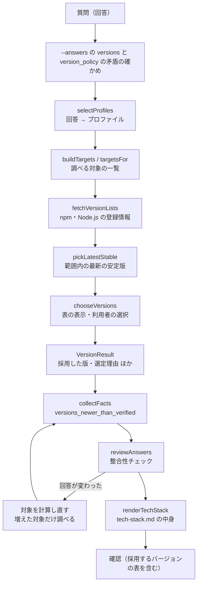

# 設計書：バージョンの調査と選定（Issue #33）

## 目的と範囲

`harness create` で、選んだ技術（npm のパッケージと Node.js）の最新の安定版を調べ、検証済みのバージョンと比べて、採用するバージョンと選定理由を決める（F-19・F-24）。結果は、`docs/tech-stack.md` の中身（文字列）として作る。

- 作るもの：回答から使うプロファイルを決める対応表、調べる対象の一覧、npm と Node.js の登録情報の取得、条件に合う最新の安定版の選び方、検証済みとの比較と警告、利用者の選択、`docs/tech-stack.md` の中身、`harness create` への組み込み
- 作らないもの
  - `docs/tech-stack.md` のファイルへの保存、`package.json` の依存の書き出し：#34。#33 は、選んだ結果と tech-stack.md の中身を `CreateOutcome`（`versions`・`techStack`）で返すまで
  - `update` での再調査：#35
- Issue #33 の AC-5 は「…が記録される内容（tech-stack.md の中身）が作られる。保存は #34」に直した
- 実装を正とする。この文書は、ファイル名と関数名で示し、コードは書き写さない

## ファイルと役割

| ファイル | 役割 |
| --- | --- |
| `data/profile-selection.yaml` | 回答から使うプロファイルを決める対応表（データ）。配布物に含める |
| `data/runtimes.yaml` | Node.js の検証済みの版（`.node-version` と同じ版にする）と、選び方（`lts`） |
| `src/versions/profile-selection.ts` | `selectProfiles`（回答 → プロファイルの key の一覧）・`parseProfileSelection`（対応表の検証）。#34 も同じ関数を使う |
| `src/versions/targets.ts` | `buildTargets`・`targetsFor`：調べる対象（`Target`）の一覧を作る。範囲の交わり・検証済みの食い違いの検査もここ |
| `src/versions/registry.ts` | `fetchVersionLists`：npm と Node.js の登録情報の取得（時間切れ・同時数の上限・失敗の理由） |
| `src/versions/select.ts` | `pickLatestStable`（範囲内の最新の安定版）・`compareWithVerified`（検証済みとの比較） |
| `src/versions/choose.ts` | `chooseVersions`：調査の結果の表示・利用者の選択・つながらない場合の確かめ・選定の結果（`VersionResult`）を作る |
| `src/versions/tech-stack.ts` | `renderTechStack`：docs/tech-stack.md の中身（Markdown）を作る |
| `src/generate/profile.ts` | `loadProfile`：profile.yaml の `packages`・`packages_when`・`verified_versions`・`version_ranges`・`external_tools`・`unverified`・`compatibility_notes` の読み込みと検証 |
| `src/questions/answers.ts` | `parseAnswersYaml`：`--answers` の `versions`・`versions_offline` の読み込みと検証 |
| `src/commands/create.ts` | 質問の後・整合性チェックの前にバージョンの調査を組み込む。再計算・確認の表示・結果の返却 |
| `test/versions/*.test.ts`・`test/versions/helpers.ts` | 単体のテスト（偽の `fetch`。本物のネットワークには接続しない） |
| `test/commands/create-versions.test.ts` | `create` を通したテスト |

## 処理の流れ

1. 質問が終わった回答から、`--answers` の `versions` と `version_policy` の矛盾（`verified` なのに `latest`）・`versions` の名前が対象にあるかを確かめる
2. `selectProfiles` でプロファイルを決め、`targetsFor` で調べる対象を作る
3. `chooseVersions` が登録情報を取得し、表を見せ、利用者の選択（または `--answers` の指定）に従って、技術ごとの版を決める
4. 結果から整合性チェックの事実 `versions_newer_than_verified` を作り、`reviewAnswers` に渡す（ルール7）
5. 整合性チェックの聞き直しで回答が変わったら、対象を計算し直す（後述）
6. 最終の回答に合うプロファイルで `renderTechStack` を呼び、`CreateOutcome` に `versions`・`techStack` を入れて返す。確認の一覧には、採用するバージョンの表（「採用するバージョン」）を加える

## 回答から使うプロファイルを決める対応表

`data/profile-selection.yaml` に、プロファイル（`<分類>/<id>`）と、選ぶ条件（回答の質問の id と、`equals`・`in`・`notEquals` のどれか1つ。整合性チェックの条件と同じ書き方）を書く。`when` を書かなければ常に選ぶ。

| 条件 | プロファイル |
| --- | --- |
| 常に | `backend-framework/hono`・`logger/structured-logger`・`frontend-build/vite-react-router`・`http-client/axios`・`frontend-state/tanstack-query-rhf-zod`・`test-framework/vitest-playwright`・`quality/typescript-standard` |
| `database` が `none` でない | `data-access/drizzle` |

- 読み込み時に、プロファイルがない・知らない質問の id・知らない項目・条件の書き方の誤りは、`GenerateError`（日本語）にする
- 選んだ順に、重複なしで返す

## 調べる対象の作り方

`buildTargets` が、選んだプロファイルから、`Target`（種類・名前・検証済み・範囲・未検証か・持つプロファイル）の一覧を作る。先頭は Node.js。

| 項目 | 内容 |
| --- | --- |
| `packages` | 各プロファイルの `packages` を、対象に加える |
| `packages_when` | 「回答 → 追加するパッケージ」。回答に合うときだけ対象に加える。例：drizzle は、`database` が `postgresql` のとき `pg` を加える（D1・DB なしでは加えない） |
| 名前の確認 | `version_ranges`・`verified_versions`・`unverified` に書く名前は、`packages` と `packages_when` に書かれたすべてのパッケージの中にあることを、読み込み時に確かめる。対象に加えるのは、回答に合う条件のものだけ |
| `external_tools` | npm で入れない道具（例：k6）。バージョンの調査の対象にしない（手順書で導入する）。`packages` と二重に書くとエラー |
| `unverified` | 検証済みの版のないパッケージを明示する仕組み。方針にかかわらず範囲内の最新の安定版を使い、選定理由を「ハーネスで未検証」にし、確認の表示で警告する。取得できない場合や合う安定版がない場合は、戻せる版がないため進めない（終了コード1）。今の8つのプロファイルには、未検証のものはない（将来のプロファイルのために残す） |
| 検証済みのない `packages` | `unverified` にも書かれていなければ、プロファイルの誤りとしてエラー |
| 範囲（`version_ranges`） | パッケージ名 → semver の範囲。読み込み時に、範囲として正しいかと、検証済みの版が範囲に合うかを確かめる |
| 範囲の交わり | 同じパッケージの範囲が複数のプロファイルにある場合は、両方に合う範囲（交わり）を使う。交わりが空ならエラー |
| 検証済みの食い違い | 同じパッケージの検証済みの版がプロファイル同士で違う場合はエラー。検証済みの版は、安定版（試験版でない）でなければならない |
| Node.js | `data/runtimes.yaml` の検証済みの版を使い、選び方は LTS |

文章の `compatibility_notes` は、説明として残し、tech-stack.md の「組み合わせの条件」にそのまま載せる。範囲で表せない注意（`allowScripts` 等）は `version_ranges` に写さない。

## 取得（registry.ts）

| 項目 | 内容 |
| --- | --- |
| npm | `https://registry.npmjs.org/<名前>` を、`Accept: application/vnd.npm.install-v1+json`（短い形の登録情報）で取得し、`versions` のキーの一覧を得る。スコープ付きの名前は、`/` をエンコードする。`versions` がない形は「取得できない」にする |
| Node.js | `https://nodejs.org/dist/index.json` から、`lts` が偽でない（LTS の）版を得る。先頭の `v` は除く。形が違えば「取得できない」にする |
| `fetch` の差し替え | `fetchVersionLists` と `chooseVersions` は `fetch` を引数で受ける（`CreateDeps.fetch`。既定は `globalThis.fetch`）。テストでは偽の `fetch` を渡し、本物のネットワークを使わない |
| 時間切れ | 1回の取得ごとに10秒（`AbortController`）。時間切れは、その旨を理由に示す |
| 同時の数 | 同時に取得する数の上限は6 |
| 失敗の理由 | つながらない・時間切れ・HTTP のエラー（ステータスを示す）・JSON として読めない・形が想定と違う、を、パッケージごとに理由を付けて `ok: false` で返す（例外にしない・もみ消さない） |

試験版も含めて、登録情報の版をそのまま返す。選ぶのは `select.ts`。

## 選び方と比較（select.ts）

- `pickLatestStable`：安定版だけ（`semver.prerelease` が null）の中で、範囲（あれば）に合う最大の版。RC・ベータ・alpha・next などは選ばない。`dist-tags` の `latest` は使わない（試験版を指すことがあるため）。semver として読めない文字列は無視する
- Node.js は、LTS の版の中の最大
- `compareWithVerified`：検証済みと候補を比べ、同じ・新しい・古い、と、大きな版（メジャー）が違うかを返す
- 範囲に合う安定版がない場合は、検証済み（範囲に合うことは読み込み時に確かめ済み）を使い、理由に「範囲に合う安定版がないため、ハーネス検証済みを使用」と書く

### 警告

- 大きな版が検証済みと違う版を採用する場合は、「大きな版が違い、ハーネスで動作を確認していません」と、該当するパッケージを表示する（AC-3）。tech-stack.md の「注意」にも載せる
- 小さな版の違いだけなら、この警告は出さない
- 整合性チェックのルール7（`version-newer-than-verified`）は、「検証済みより新しい版を1つでも採用した」という事実（`versions_newer_than_verified`）で判定する。理由には、該当するパッケージと、大きな版が違うものを添える（承知を求める前に表示する）

## 利用者の選択（choose.ts）

質問16（`version_policy`）の答えに従う。方針にかかわらず、F-19 のとおり最新の安定版は調べて並べ、調べた日と、そのとき確認した最新の安定版を記録する。

| 場合 | 動き |
| --- | --- |
| `verified`（既定の選択肢） | 検証済みを採用する（選定理由「ハーネス検証済み」）。登録情報を取得できなくても止めず、最新の安定版を「未確認」として表示・記録する。確認（つながらない場合の確かめ）は、`unverified` のパッケージがあるときだけ |
| `latest`・対話 | 「検証済み｜最新の安定版（範囲内）｜比較」の表を見せ、「すべて最新の安定版（範囲内）」「すべて検証済み」「技術ごとに選ぶ」から選ぶ。技術ごとに選ぶと、パッケージごとに最新の安定版か検証済みかを聞く |
| `latest`・対話しない | `versions` に書かれたパッケージはその指定、書かれていないパッケージは範囲内の最新の安定版（質問16の答えに従う） |

### `--answers` の `versions`・`versions_offline`

| キー | 書き方 | 内容 |
| --- | --- | --- |
| `versions` | `パッケージ名: verified` または `latest` | 技術ごとの選択。`node` の名前も使える |
| `versions_offline` | `verified` だけ | 登録情報を取得できないとき、検証済みのバージョンで進めることの承知（対話しない実行の用） |

矛盾の確かめ：

- `versions` に、対象にないパッケージ名・`verified` と `latest` 以外の値がある場合はエラー
- `version_policy` が `verified` なのに、`versions` に `latest` がある場合はエラー（`parseAnswersYaml` で、回答ファイルの値が分かる場合。対話で `version_policy` を選んだ場合は、`create` が質問の後に確かめる）
- 対象は回答で決まるため、対象にあるかの確かめは、質問の後に `create` が行う

## ネットワークにつながらない場合（AC-4）

方針 `latest` で、最新の安定版を選ぶ対象の取得が1つでも失敗した場合（利用者が `versions` で `verified` を選んだものは除く）。

| 実行 | 動き |
| --- | --- |
| 対話 | 取得できなかったパッケージと理由を示し、「検証済みのバージョンで進めますか」を確かめる。はい → すべて検証済みで進む。いいえ → 終了コード1（ネットワークに接続してから、もう一度実行するよう案内する） |
| 対話しない | `versions_offline: verified` があれば、検証済みで進む。なければ、理由と書き方を示して終了コード1 |

- 取得できなかった理由は、方針や `versions` の指定にかかわらず、失敗したすべてのパッケージについて表示する
- `unverified` のパッケージが取得できない場合は、確かめず、理由を示して終了コード1

## `latestStatus` と tech-stack.md の中身

`VersionEntry`（パッケージごとの選定の結果）は、採用した版・選定理由・調べた日・確認した最新の安定版・検証済み・検証済みより新しいか・大きな版が違うか、を持つ。最新の安定版の調査の結果は `latestStatus` で区別する。

| `latestStatus` | 意味 | tech-stack.md の「確認した最新の安定版」 |
| --- | --- | --- |
| `found` | 取得できて、範囲内の最新の安定版があった | その版 |
| `none_in_range` | 取得できたが、範囲に合う安定版がない | 範囲に合う安定版なし |
| `failed` | 取得できなかった（理由は `fetchFailure`） | 未確認（取得できませんでした） |

`renderTechStack` は、表（技術・採用したバージョン・選定理由・調べた日・確認した最新の安定版・検証済み）と、表の見方、大きな版が違う場合の注意、プロファイルごとの組み合わせの条件（`compatibilityNotes`）を、Markdown で作る。同じ入力なら同じ出力にする。「未確認」は、調べていないことを調べたと誤解させないために、明記する。

## 調べた日

調べた日（`surveyedOn`）は、利用者のPCのローカルの日付（YYYY-MM-DD）。UTC の日付にすると、日本の朝に前日の日付になるため使わない。`create` は、`CreateDeps.now`（テストでは固定の日時）から決める。

## 回答の変更の後の再計算

整合性チェックの聞き直しで回答が変わった場合（例：DB なし → Cloudflare D1）、`collectFacts` の前に、`targetsFor` で対象を計算し直す。

- 増えた対象だけを調べて選ぶ。既に選んだもの（`keep`）は、調べ直さず、そのまま結果に入れる
- 減った対象は、結果から除く
- 事実（`versions_newer_than_verified`）を、新しい結果から計算し直す
- 最終の回答に合うプロファイルで tech-stack.md の中身を作るため、確認の表・返す結果・tech-stack.md の中身は一致する

## テストと受け入れ条件の対応

| 受け入れ条件 | テスト |
| --- | --- |
| AC-1：最新の安定版を取得する（試験版は選ばない） | `test/versions/registry.test.ts`（npm・Node.js の取得・同時数）・`select.test.ts`・`choose.test.ts`・`test/commands/create-versions.test.ts`（偽の `fetch`） |
| AC-2：範囲に合う中で最新を選ぶ | `select.test.ts`・`targets.test.ts`（範囲の交わり・`packages_when`・実際のプロファイルの対象）・`test/generate/profile.test.ts`（`version_ranges` ほかの検証）・`create-versions.test.ts` |
| AC-3：大きな版が違うと警告する | `select.test.ts`・`choose.test.ts`・`create-versions.test.ts`（ルール7の理由に該当するパッケージ） |
| AC-4：つながらない場合に確かめる | `registry.test.ts`（失敗の理由）・`choose.test.ts`・`create-versions.test.ts`（はい・いいえ・`versions_offline`） |
| AC-5：選んだ版と選定理由の内容が作られる | `tech-stack.test.ts`（中身・未確認・`latestStatus`）・`create-versions.test.ts`（最終の選択が中身に反映される） |
| 回答ファイルの `versions` ほか | `test/questions/answers.test.ts`・`create-versions.test.ts` |
| 回答の変更の後の再計算 | `create-versions.test.ts` |
| 調べた日がローカルの日付 | `choose.test.ts`・`create-versions.test.ts` |

テストの値と名前はすべて架空。本物のネットワークには接続しない。

## 関係する Issue と要件

- 要件：[F-19](../requirements/functional.md#f-19)（バージョンの調査と選定理由の記録）・[F-24](../requirements/functional.md#f-24)（技術プロファイル）・[F-08](../requirements/functional.md#f-08)（ルール7）・[C-62](../requirements/common/quality-test.md#c-62)（バージョンの固定）
- Issue：#32（質問と整合性チェック。ルール7の事実を受ける形を用意）、#33（この設計）、#34（tech-stack.md の保存・package.json の依存の書き出し。`selectProfiles` を共用）、#35（update）
- 関連する設計書：[questions.md](questions.md)・[generator.md](generator.md)・[overview.md](overview.md)
